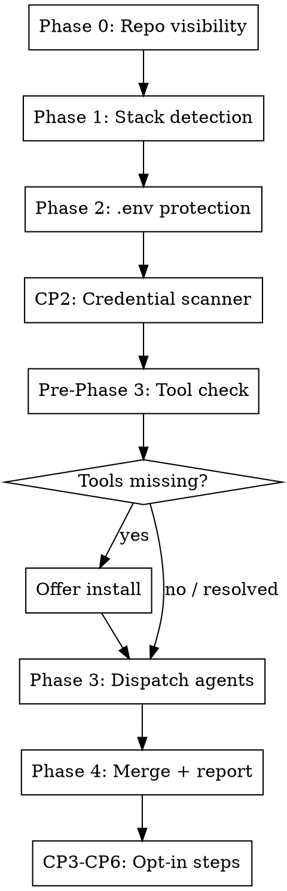

# save-yourself v0.3 — Design Spec

**Date:** 2026-04-26
**Author:** brainstorming session
**Status:** approved, ready for implementation

---

## Overview

Refactor `save-yourself` from a sequential single-session skill into a two-tier orchestrator that dispatches parallel specialist agents for Phase 3 dependency audits. Add flow diagrams, hard gates, and "when NOT to use" guards to SKILL.md. Improve Java vulnerability detection with a two-step manifest generation approach.

---

## Goals

1. Parallel Phase 3 — one agent per detected stack runs concurrently, reducing wall-clock time on multi-stack repos
2. Better Java coverage — two-step mvn/gradle → osv-scanner with transitive dep generation, fallback to direct scan
3. Better UX for missing tools — pre-dispatch tool check with interactive install offers before any agent is spawned
4. Clearer skill structure — DOT flow diagram, hard gate, "when NOT to use" guard in SKILL.md

## Non-Goals

- Restructuring or renaming existing reference files
- Adding a new ambient PreToolUse hook (CP6 already covers this)
- CLI distribution track (tracked separately in TODOS.md)

---

## Architecture

### Two-Tier Orchestrator

```
MAIN SESSION (orchestrator)
├── Phase 0: Repo visibility          — sets PUBLIC_REPO flag
├── Phase 1: Stack detection          — produces stack list + manifest paths
├── Phase 2: .env protection          — reads references/phase2-env.md
├── CP2: Credential file scanner      — reads references/cp2-credentials.md
├── Pre-Phase 3: Tool availability    — checks + offers to install missing tools
│
├── Phase 3: Parallel dispatch        ← NEW
│   ├── Agent(node)  → .claude/save-yourself-audit-node.json
│   ├── Agent(go)    → .claude/save-yourself-audit-go.json
│   ├── Agent(rust)  → .claude/save-yourself-audit-rust.json
│   ├── Agent(python)→ .claude/save-yourself-audit-python.json
│   └── Agent(java)  → .claude/save-yourself-audit-java.json
│         (two-step: mvn/gradle generate → osv-scanner, fallback to direct)
│
├── Phase 4: Merge + report           — reads all *.json, applies CP1, fills summary-format.md
└── CP3–CP6: Opt-in steps             — run in main session after report
```

Phases 0–2 and CP2 remain sequential in the main session — they are fast, order-dependent, and share state (PUBLIC_REPO, manifest paths) that agents need.

Phase 3 agents are completely isolated — they receive no session context beyond what the orchestrator injects in the dispatch prompt.

### New Files

```
references/agents/
  node-agent.md
  go-agent.md
  rust-agent.md
  python-agent.md
  java-agent.md
```

All other existing reference files remain in place, unchanged.

---

## Agent Contract

### Dispatch Prompt (orchestrator injects per agent)

```
Read references/agents/<stack>-agent.md and follow it completely.

Context:
- PUBLIC_REPO: <true|false|unknown>
- Manifests: ["path/to/manifest", ...]
- Output file: .claude/save-yourself-audit-<stack>.json
```

Agents receive no other context from the main session.

### Output Schema (written to temp file by each agent)

```json
{
  "stack": "java",
  "status": "ok | skip | error",
  "findings": [
    {
      "package": "...",
      "installed": "...",
      "fixed": "...",
      "severity": "LOW | MEDIUM | HIGH | CRITICAL",
      "cve": "CVE-...",
      "description": "..."
    }
  ],
  "skip_reason": "osv-scanner not installed",
  "coverage_note": "Transitive coverage: full (lock file generated)",
  "error": null
}
```

`findings` is an empty array when `status` is `skip` or `error`.

### Orchestrator Merge Logic (Phase 4)

1. For each expected output file: check existence
2. Missing file → report "scan incomplete for <stack> — agent did not produce output"
3. `status: skip` → report skip_reason in summary, no findings
4. `status: error` → report error in summary, no findings
5. `status: ok` → extract findings, apply CP1 severity escalation, feed into summary-format.md

---

## Pre-Phase 3: Tool Availability Check

Runs in the main session before any agent is dispatched. Interactive.

| Stack  | Tool         | Check command           |
|--------|--------------|-------------------------|
| Node   | npm          | `which npm`             |
| Go     | govulncheck  | `which govulncheck`     |
| Rust   | cargo-audit  | `cargo audit --version` |
| Python | pip-audit    | `which pip-audit`       |
| Java   | osv-scanner  | `which osv-scanner`     |

For each missing tool:
- Narrate: "`osv-scanner` is required for Java audit but isn't installed."
- Offer: "Want me to install it now?"
  - macOS: `brew install osv-scanner`
  - Linux/other: show GitHub releases URL
- If user yes → install → verify → mark stack ready
- If user no → mark stack skip → note in final report
- If install fails → mark stack skip → note error in report

Only dispatch agents for stacks marked ready. Never dispatch an agent that will immediately return skip.

---

## Java Two-Step Detail

`osv-scanner --lockfile` does NOT understand Maven/Gradle text output — it only accepts
known lockfile formats (package-lock.json, go.sum, Cargo.lock, etc.). Instead, Step 1
generates a CycloneDX SBOM (Software Bill of Materials) that osv-scanner can consume
with `--sbom`, giving full transitive dependency coverage.

### Step 1 — Attempt SBOM generation

Maven (CycloneDX plugin, invocable without adding it to pom.xml):
```bash
mvn org.cyclonedx:cyclonedx-maven-plugin:2.7.9:makeAggregateBom -q 2>/dev/null
# → generates target/bom.json (and target/bom.xml)
```

Gradle (requires CycloneDX Gradle plugin configured in the project):
```bash
gradle cyclonedxBom -q 2>/dev/null
# → generates build/reports/bom.json
```

Check generated file: if `target/bom.json` or `build/reports/bom.json` exists and is
non-empty → proceed to Step 2 with SBOM.
If both fail → proceed to Step 2 with direct scan. Note coverage limitation.

### Step 2 — osv-scanner

With SBOM:
```bash
osv-scanner --format json --sbom target/bom.json
# or
osv-scanner --format json --sbom build/reports/bom.json
```

Fallback (direct scan — reads pom.xml/build.gradle directly, no transitive deps):
```bash
osv-scanner --format json .
```

### Step 3 — Cleanup
```bash
rm -f target/bom.json target/bom.xml build/reports/bom.json
```

### Coverage Note in Output

Always set `coverage_note` in the agent's JSON output:
- `"Transitive coverage: full (CycloneDX SBOM generated via Maven/Gradle)"`
- `"Transitive coverage: limited (SBOM generation failed — direct pom.xml scan only)"`

### Java Agent Failure Modes

| Situation | Behavior |
|---|---|
| `mvn` not installed | Skip Step 1, direct scan. Note in coverage_note. |
| `mvn` installed, SBOM generation fails | Skip Step 1, direct scan. Note in coverage_note. |
| Gradle CycloneDX plugin not configured | Skip Gradle Step 1, try Maven. If Maven also fails, direct scan. |
| Generated bom.json is empty or missing | Treat as generation failure, direct scan. |
| Multiple pom.xml (monorepo) | Run Step 1 from repo root only. Note scope in coverage_note. |
| `osv-scanner` exits 1 | Treat as "findings present" — parse stdout as normal. |
| `osv-scanner` stdout empty or invalid JSON | Set `status: error`, include raw output in `error` field. |

---

## SKILL.md Structural Changes

### 1. DOT Flow Diagram (after intro, before Phase 0)



### 2. Hard Gate (before Phase 3 section)

```
⛔ HARD GATE: Do NOT dispatch Phase 3 agents until ALL of the following are complete:
  - Phase 0 (PUBLIC_REPO flag is set)
  - Phase 1 (stack list and manifest paths are finalized)
  - Phase 2 (.env findings are recorded)
  - CP2 (credential findings are recorded)
  - Pre-Phase 3 tool check (all agent tools confirmed available)

Phase 3 agents depend on PUBLIC_REPO and manifest paths from these phases.
Dispatching early produces incomplete or incorrect agent output.
```

### 3. "When NOT to Use" Guard (very top of skill, after description)

```
## When NOT to use this skill

- User only wants .env check: run Phase 2 only, skip Phase 3 entirely
- No dependency manifests found (no lockfiles, no package files):
  skip Phase 3, tell user "No dependency manifests found — running env/credential checks only."
- Read-only filesystem: warn upfront that CP5/CP6 hook installation will fail
```

---

## File Changes Summary

| File | Change |
|------|--------|
| `skills/save-yourself/SKILL.md` | Add flow diagram, hard gate, "when not to use" guard, Pre-Phase 3 tool check section, Phase 3 parallel dispatch instructions |
| `skills/save-yourself/references/agents/node-agent.md` | New — Node.js specialist agent prompt |
| `skills/save-yourself/references/agents/go-agent.md` | New — Go specialist agent prompt |
| `skills/save-yourself/references/agents/rust-agent.md` | New — Rust specialist agent prompt |
| `skills/save-yourself/references/agents/python-agent.md` | New — Python specialist agent prompt |
| `skills/save-yourself/references/agents/java-agent.md` | New — Java specialist agent prompt (two-step) |
| `skills/save-yourself/references/phase3-java.md` | Update — document two-step approach, update CI section |
| `.claude-plugin/plugin.json` | Bump version to 0.3.0 |
| `CHANGELOG.md` | Add v0.3.0 entry |

No existing reference files are renamed or moved.

---

## Testing

Before shipping:
1. Run on a Node-only repo — confirm single agent dispatched, others skipped
2. Run on a monorepo with Node + Python — confirm two parallel agents, merged report
3. Run on a Java repo with Maven installed — confirm two-step generates lock file, coverage note says "full"
4. Run on a Java repo without Maven — confirm fallback to direct scan, coverage note says "limited"
5. Run with osv-scanner missing — confirm pre-dispatch check fires, install offer shown, not skipped silently
6. Run with all tools missing — confirm each stack gets interactive install offer sequentially
