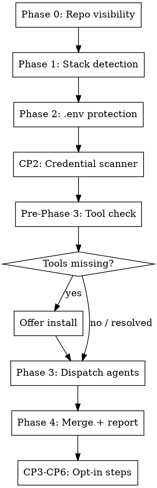

# /save-yourself — Security Bootstrapper

One command. Leave the project hardened.

Before starting, tell the user: "Running /save-yourself security scan. This will
check your .env setup, scan for leaked credentials, and audit dependencies. I'll
narrate each step as I go."

## When NOT to use this skill

- User only wants to check .env: run Phase 2 only, skip Phase 3 entirely.
- No dependency manifests found (no lockfiles, no package files): skip Phase 3. Tell the user: "No dependency manifests found — running env/credential checks only."
- Read-only filesystem: warn upfront that CP5/CP6 hook installation will fail.

---

## Flow



---

## Phase 0: Repo Visibility

Narrate: "Checking repo visibility..."

```bash
IS_PUBLIC=$(gh repo view --json isPrivate -q '.isPrivate' 2>/dev/null)
```

- Output `false` → repo is public. Set `PUBLIC_REPO=true`.
  Show: `⚠️  PUBLIC REPO: credential leaks are indexed immediately by search engines and bots.`
- Output `true` → repo is private. Set `PUBLIC_REPO=false`.
- Any error or empty → set `PUBLIC_REPO=unknown`.
  Note: "Could not verify repo visibility — assuming private. Severity escalation will not apply."

**CP1 rule** (active for the rest of the skill when `PUBLIC_REPO=true`):
All severity findings get +1 tier: LOW→MEDIUM, MEDIUM→HIGH, HIGH→CRITICAL.
CRITICAL stays CRITICAL. Apply before reporting any finding.

---

## Phase 1: Stack Detection

Narrate: "Detecting project stack..."

```bash
[ -f package.json ]    && echo "NODE"
[ -f go.mod ]          && echo "GO"
[ -f Cargo.toml ]      && echo "RUST"
{ [ -f requirements.txt ] || [ -f pyproject.toml ] || [ -f setup.py ]; } && echo "PYTHON"
{ [ -f pom.xml ] || [ -f build.gradle ] || [ -f build.gradle.kts ]; }    && echo "JAVA"
```

Also check one level down for monorepos:

```bash
find . -maxdepth 2 -name "package.json" ! -path "*/node_modules/*"
find . -maxdepth 2 -name "go.mod"
find . -maxdepth 2 -name "Cargo.toml"
find . -maxdepth 2 \( -name "requirements.txt" -o -name "pyproject.toml" -o -name "setup.py" \)
find . -maxdepth 2 \( -name "pom.xml" -o -name "build.gradle" -o -name "build.gradle.kts" \)
```

Report: "Found [detected stacks] in this project."

If no lockfile found at root or one level down: ask the user which stack they're using.
Accept "node", "go", "rust", "python", "java" and proceed with that audit only.

---

## Phase 2: .env Protection Suite

Narrate: "Checking .env protection..."

Read @references/phase2-env.md and follow it completely.

---

## CP2: Credential File Scanner

Narrate: "Scanning for tracked credential files..."

Read @references/cp2-credentials.md and follow it completely.

---

## Pre-Phase 3: Tool Availability Check

Narrate: "Checking required audit tools..."

For each stack detected in Phase 1, verify the required tool is installed:

| Stack  | Tool         | Check command            |
|--------|--------------|--------------------------|
| Node   | npm          | `which npm`              |
| Go     | govulncheck  | `which govulncheck`      |
| Rust   | cargo-audit  | `cargo audit --version`  |
| Python | pip-audit    | `which pip-audit`        |
| Java   | osv-scanner  | `which osv-scanner`      |

Only check rows for stacks detected in Phase 1. Skip the rest.

If the tool check command succeeds: mark stack **ready** and continue to the next stack.

For each **missing** tool:
- Narrate: "`<tool>` is required for <Stack> audit but is not installed."
- Offer: "Want me to install it now?"
  - macOS install commands:
    - npm: ships with Node.js — install Node.js via `brew install node`
    - govulncheck: `go install golang.org/x/vuln/cmd/govulncheck@latest`
    - cargo-audit: `cargo install cargo-audit`
    - pip-audit: `pip install pip-audit`
    - osv-scanner: `brew install osv-scanner`
  - Linux/other:
    - govulncheck: `go install golang.org/x/vuln/cmd/govulncheck@latest` (same as macOS)
    - cargo-audit: `cargo install cargo-audit` (same as macOS)
    - pip-audit: `pip install pip-audit` (same as macOS)
    - npm: install Node.js via your distro's package manager (e.g. `apt install nodejs npm`)
    - osv-scanner: see https://github.com/google/osv-scanner/releases
- If user says **yes**: run the install, re-run the check command to verify. Mark stack **ready**.
- If user says **no**: mark stack **skip**. Will appear as "skipped (tool not installed)" in the Phase 4 report.
- If install fails: mark stack **skip**, include the error in the Phase 4 report.

Only stacks marked **ready** are dispatched in Phase 3.
Never dispatch an agent for a stack marked **skip** — doing so wastes a context window.

---

## Phase 3: Dependency Audit

Narrate: "Running dependency audit..."

For each detected stack, read the corresponding reference and follow it:

| Stack   | Reference                    | Tool        |
|---------|------------------------------|-------------|
| Node.js | @references/phase3-node.md   | npm audit   |
| Go      | @references/phase3-go.md     | govulncheck |
| Rust    | @references/phase3-rust.md   | cargo audit |
| Python  | @references/phase3-python.md | pip-audit   |
| Java    | @references/phase3-java.md   | osv-scanner |

Read only the files for detected stacks. Skip the rest.

---

## Phase 4: Summary Report

Read @references/summary-format.md for the report template and fill it in.

Always end the report with:
"Note: This scan covers common patterns only. It is not a substitute for a
professional security audit."

---

## CP3: GitHub Actions Workflow (opt-in)

After Phase 4, offer:
> "Want me to create a GitHub Actions workflow that runs these checks on every PR?"

If no supported lockfile found: "No supported language detected — workflow would run zero checks. Skipping."

If `.github/workflows/save-yourself.yml` already exists: "A workflow already exists. Overwrite it?"

If user says yes (or no existing file), create `.github/workflows/save-yourself.yml`:

```yaml
name: Security Audit
permissions:
  contents: read
on:
  pull_request:
    branches: [main, master]
  push:
    branches: [main, master]

jobs:
  security:
    runs-on: ubuntu-latest
    steps:
      - uses: actions/checkout@v4
        with:
          fetch-depth: 0

      - name: Node.js dependency audit
        if: hashFiles('package.json') != ''
        run: npm audit --audit-level=high

      - name: Go vulnerability check
        if: hashFiles('go.mod') != ''
        run: |
          go install golang.org/x/vuln/cmd/govulncheck@latest
          govulncheck ./...

      - name: Rust security audit
        if: hashFiles('Cargo.toml') != ''
        uses: rustsec/audit-check@v2
        with:
          token: ${{ secrets.GITHUB_TOKEN }}

      # Canonical version in references/phase3-python.md — keep in sync
      - name: Python dependency audit
        if: hashFiles('requirements.txt') != '' || hashFiles('pyproject.toml') != '' || hashFiles('setup.py') != ''
        run: |
          pip install --quiet pip-audit
          pip install --quiet -r requirements.txt 2>/dev/null || pip install --quiet -e . 2>/dev/null \
            || echo "::warning::pip install failed — pip-audit may scan an incomplete environment"
          pip-audit --format json | python3 -c "
          import json,sys
          data=json.load(sys.stdin)
          vulns=[v for r in data for v in r.get('vulns',[])]
          if vulns:
            print(f'::error::{len(vulns)} vulnerable Python package(s) found')
            sys.exit(1)
          "

      # Canonical version in references/phase3-java.md — keep in sync
      - name: Java dependency scan (osv-scanner)
        if: hashFiles('pom.xml') != '' || hashFiles('build.gradle') != '' || hashFiles('build.gradle.kts') != ''
        uses: google/osv-scanner-action@v1
        with:
          scan-args: |-
            --format=json
            ./

      - name: Check for .env in git history
        run: |
          if git log --all --full-history -- .env .env.local .env.production .env.staging | grep -q .; then
            echo "::error::.env found in git history — run git filter-repo to remove"
            exit 1
          fi
```

Generate the file. Do not auto-commit. Tell the user to review and commit it.

---

## CP4: CLAUDE.md Security Status (opt-in)

After CP3 resolves, offer:
> "Want me to add a security status block to CLAUDE.md so future sessions inherit this context?"

If yes:

Check if `CLAUDE.md` exists. Create it if missing.

Check for existing section:
```bash
grep -n "^## Security Status" CLAUDE.md 2>/dev/null
```

If section exists: replace it entirely using the Edit tool.
- `old_string`: the full `## Security Status` block from `## Security Status\n` through the next `## ` heading or EOF.
- `new_string`: the updated block.

If section does not exist: append to EOF.

Block to write:
```markdown
## Security Status
Last scanned: {ISO date}
By: /save-yourself skill
Summary: {N} issues found, {M} auto-fixed, {K} action required
Critical: {list of unresolved CRITICAL findings, or "none"}
→ Re-run /save-yourself before each release.
```

N = total findings. M = auto-applied fixes (.gitignore entries + .env.example). K = ACTION REQUIRED items.

---

## CP5: Guardian Mode — gitleaks Pre-Commit Hook (opt-in)

After CP4, offer:
> "Want me to add a gitleaks pre-commit hook that blocks git commits containing secrets?"

Read @references/cp5-guardian.md and follow it completely.

---

## CP6: Claude Code Defense Layer (opt-in)

After CP5, offer:
> "Want me to wire up Claude Code hooks that scan for secrets in real-time as Claude writes files?"

Read @references/cp6-cc-hooks.md and follow it completely.

---

## Failure modes

| Situation | Behavior |
|---|---|
| Empty repo (no commits) | Phase 2c: "No git history found — skipping history checks." Continue. |
| No lockfile found | Phase 1: ask user which stack. Phase 3: skip undetected stacks. |
| `package.json` but no lockfile | Phase 3: "Run `npm install` first." Skip npm audit. |
| `govulncheck` not installed | Phase 3: skip with install instructions. |
| `cargo audit` not installed | Phase 3: skip with install instructions. |
| `pip-audit` not installed | Phase 3: skip with install instructions. |
| `osv-scanner` not installed | Phase 3: skip with install instructions. |
| `gitleaks` not installed | CP5: skip with install instructions. |
| `gh` not installed or unauthenticated | Phase 0: `PUBLIC_REPO=unknown`, no CP1 escalation. |
| `python3` not available (docker check) | CP2: fall back to `grep '"auths"'`, flag MEDIUM. |
| `python3` not available (CC hook) | CP6: hook exits 0 silently — non-blocking degradation. |
| `.claude/settings.json` malformed | CP6: back up + recreate. |
| `.git/hooks/pre-commit` exists | CP5: append, never overwrite. |
| Monorepo > 20 packages | Phase 3: scan first 20, report scope limit. |
| `save-yourself.yml` workflow exists | CP3: ask before overwriting. |
| `## Security Status` exists in CLAUDE.md | CP4: replace in place (idempotent). |

## What this skill does NOT do

- `npm audit fix` — can introduce breaking changes, manual review required
- `git filter-repo` — destructive, user must run manually
- Edit source files to remove hardcoded secrets — manual
- Python pip install upgrades — manual
- Java lock file generation (mvn dependency:lock) — manual
- Full git history scan for non-.env files — too slow; manual command shown above
